# 💈 SalonHub - Distributed Microservices Salon Management Platform

A scalable distributed salon management platform built using Spring Boot Microservices architecture with API Gateway, Eureka Service Discovery, RabbitMQ event-driven communication, WebSocket notifications, and AI-powered hairstyle recommendations using OpenCV + Ollama Gemma 2B.

---

# 🚀 Tech Stack

## Backend
- Java 17
- Spring Boot
- Spring Cloud Gateway
- Eureka Service Discovery
- OpenFeign
- RabbitMQ
- WebSocket
- OpenCV
- Ollama Gemma 2B
- Maven

## Frontend
- React
- Redux
- Material UI

## AI Stack
- OpenCV Face Detection
- Gemma 2B LLM via Ollama

---

# 🏗️ System Architecture

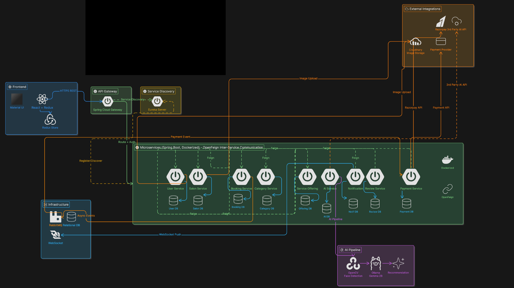


---

# 📦 Microservices Overview

| Service | Responsibility |
|---|---|
| User Service | Authentication, authorization, user profiles |
| Salon Service | Salon management and salon information |
| Booking Service | Appointment booking workflow |
| Category Service | Service categories management |
| Service Offering Service | Available salon services |
| AI Service | Face recognition + hairstyle recommendation |
| Notification Service | Real-time notifications using WebSocket |
| Review Service | Ratings and reviews |
| Payment Service | Payment processing and transaction handling |

---
# 📘 REST API Documentation

The backend APIs are documented using the OpenAPI 3.0 specification.

## 📂 OpenAPI Specification

The complete API specification file is available at:

```bash
postman/salonhub-openapi.yaml
```
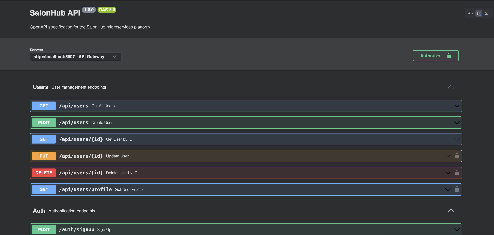

---

# 🖼️ Demo Screenshots

## Application Screens

### Home Page
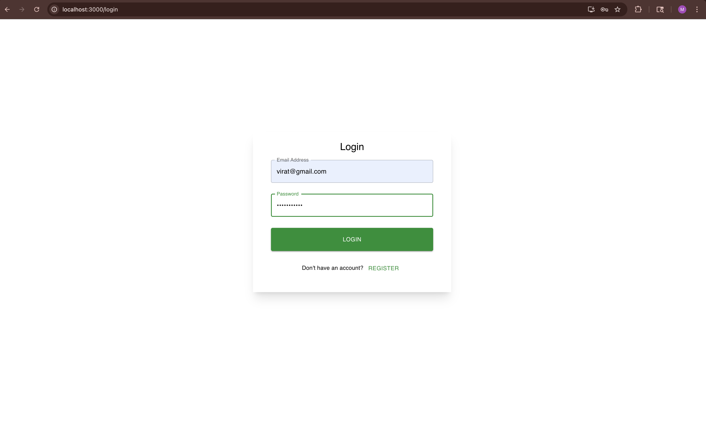

### Authentication
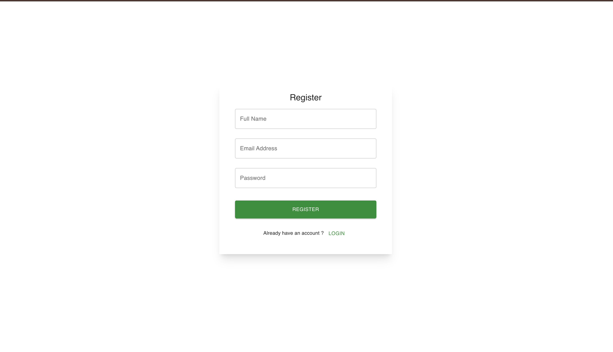

### Salon Listing
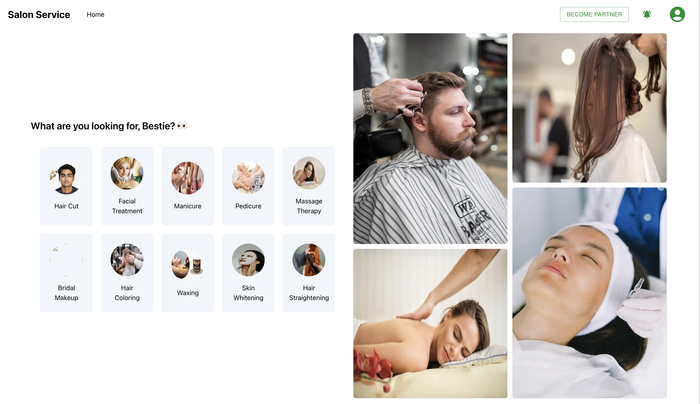

### Booking System
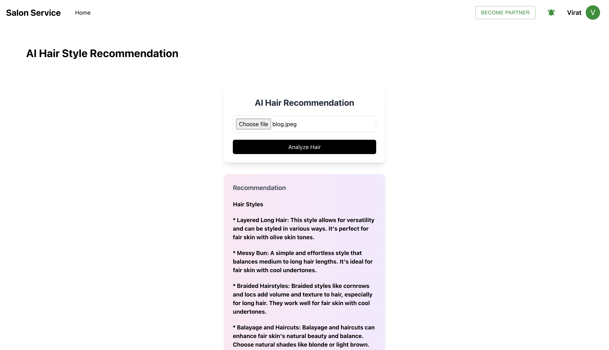

### Payment Flow
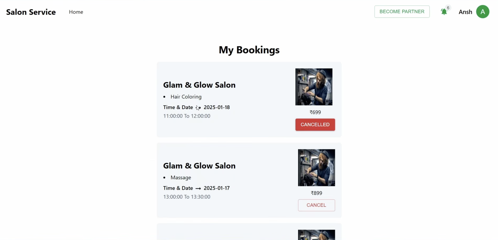

### Notifications
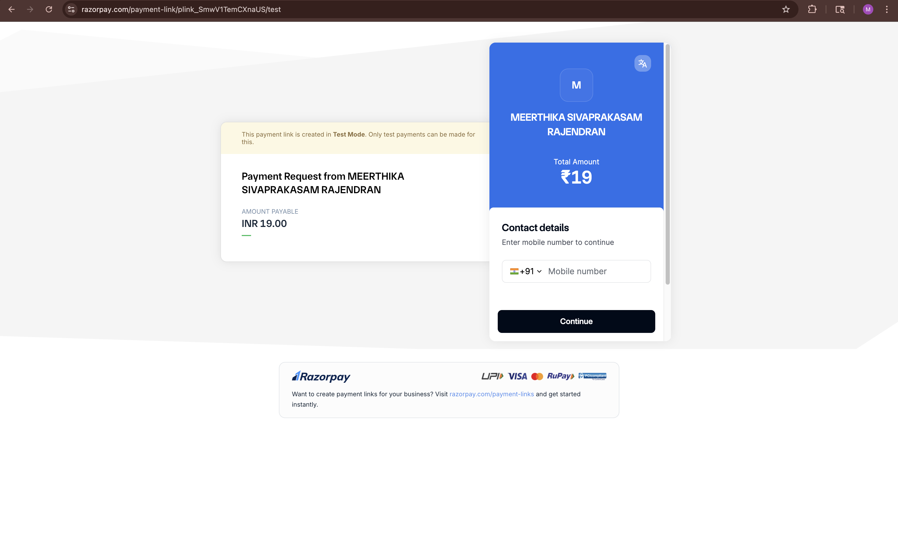

### AI Recommendation
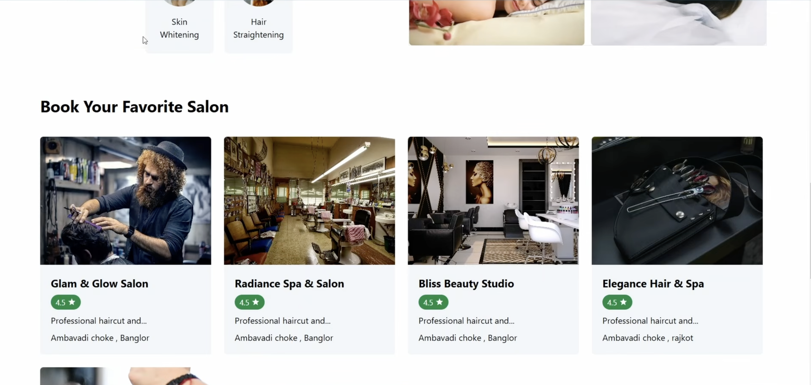

### Dashboard
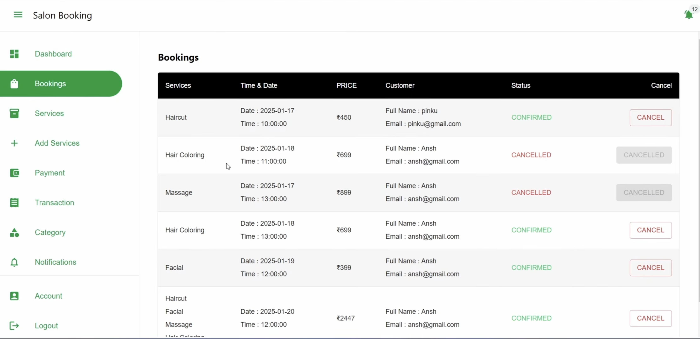

### Reviews
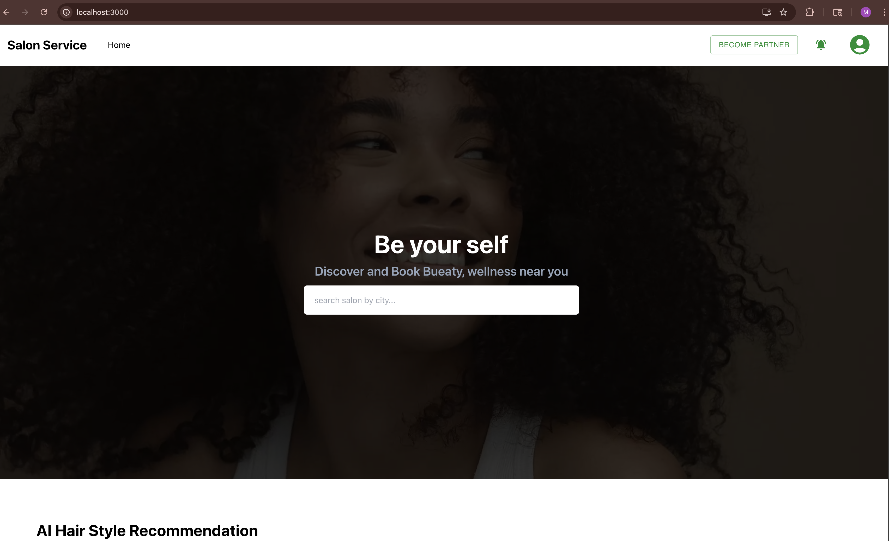

### Services
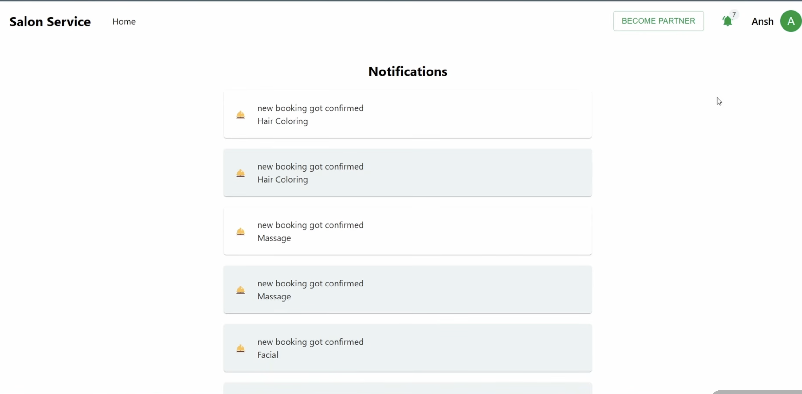

### Categories
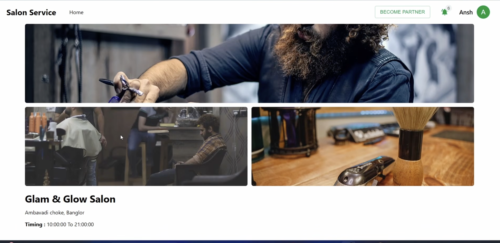

### User Profile
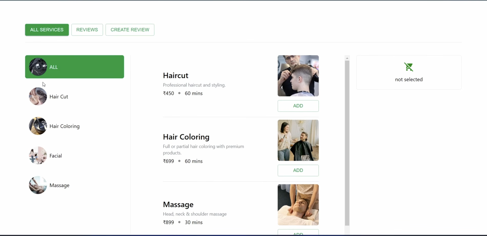

### Admin Panel
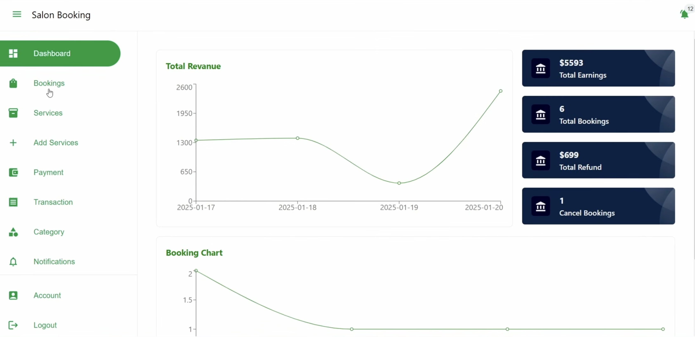

### Booking History
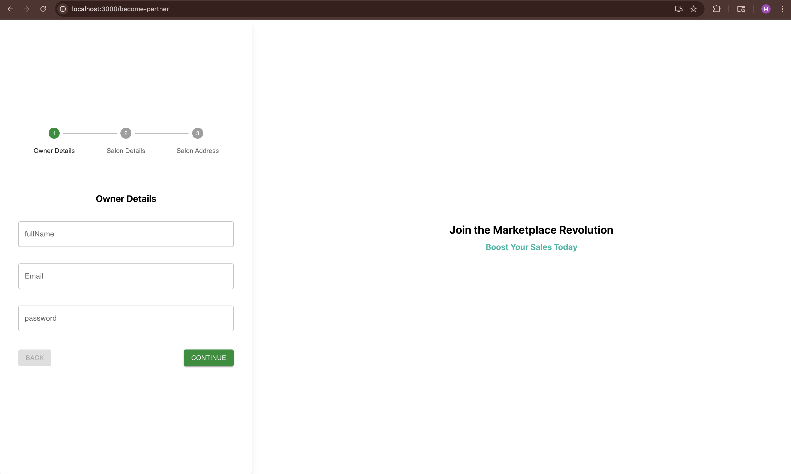

### Analytics
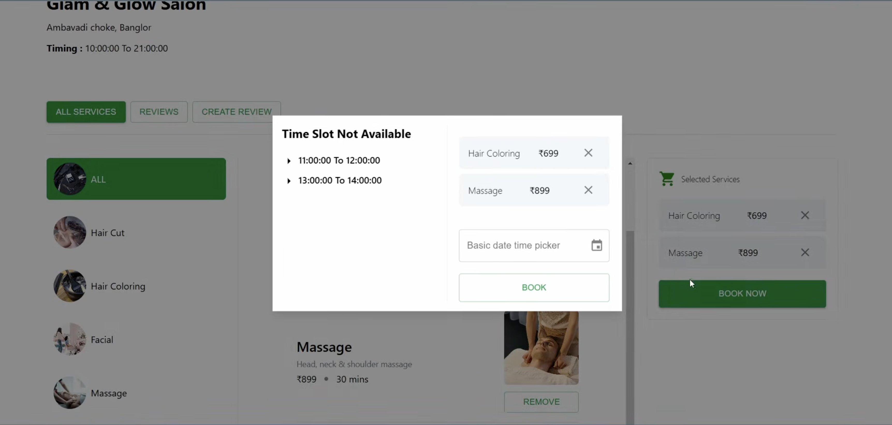

---

# 🔄 Communication Architecture

## ✅ Synchronous Communication
Services communicate internally using:

- OpenFeign Clients
- REST APIs
- Service Discovery via Eureka

### Example
```java
@FeignClient(name = "SALON-SERVICE")
public interface SalonClient {

    @GetMapping("/api/salons/{id}")
    SalonDto getSalon(@PathVariable Long id);
}
```

---

# 📨 Asynchronous Communication

RabbitMQ is used for:

- Booking Events
- Payment Processing
- Notification Triggering

## Booking Flow
1. User creates booking
2. Booking Service publishes event
3. RabbitMQ queues event
4. Payment Service consumes event
5. Payment status sent back
6. Notification Service sends updates

---

# 🔔 WebSocket Notification Flow

Real-time notifications are implemented using:

- Spring WebSocket
- STOMP Protocol

## Notification Events
- Booking Confirmation
- Payment Success
- Appointment Reminder
- Cancellation Alerts

---

# 🤖 AI Recommendation Pipeline

The AI Service performs:

## Step 1: Face Detection
- OpenCV analyzes uploaded image
- Detects face structure and shape

## Step 2: Face Shape Analysis
Supported:
- Oval
- Round
- Square
- Diamond
- Heart

## Step 3: Recommendation Engine
- Sends face metadata to Gemma 2B via Ollama
- Generates hairstyle recommendations

## Step 4: Service Suggestions
Returns:
- Suitable hairstyles
- Recommended salon services
- Personalized suggestions

---

# ⚙️ Scalability Features

## Horizontal Scaling
Each microservice can scale independently.

## Service Discovery
Eureka dynamically registers and discovers services.

## Event-Driven Architecture
RabbitMQ decouples critical workflows.

## Fault Tolerance
- Retry mechanisms
- Service isolation

## API Gateway
Centralized:
- Routing
- Authentication
- Rate limiting

---

# 🔐 Security Considerations

- JWT Authentication
- Gateway-level authorization
- Secure service communication
- WebSocket authentication
- Role-based access control

---

# 🛠️ Running the Backend Services

## 1️⃣ Clone Repository

```bash
git clone https://github.com/your-username/salon-microservices.git
cd salon-microservices
```

---

# 2️⃣ Start RabbitMQ

```bash
docker run -d --hostname rabbitmq \
--name rabbitmq \
-p 5672:5672 \
-p 15672:15672 \
rabbitmq:3-management
```

RabbitMQ Dashboard:
- http://localhost:15672
- username: guest
- password: guest

---

# 3️⃣ Start Ollama

Install Ollama:

```bash
https://ollama.com
```

Pull Gemma 2B model:

```bash
ollama pull gemma:2b
```

Run model:

```bash
ollama run gemma:2b
```

---

# 4️⃣ Start Eureka Server

```bash
cd eureka-server
mvn spring-boot:run
```

Eureka Dashboard:
- http://localhost:8761

---

# 5️⃣ Start API Gateway

```bash
cd api-gateway
mvn spring-boot:run
```

---

# 6️⃣ Start Microservices

Run all services individually:

```bash
cd user-service
mvn spring-boot:run
```

```bash
cd salon-service
mvn spring-boot:run
```

```bash
cd booking-service
mvn spring-boot:run
```

```bash
cd payment-service
mvn spring-boot:run
```

```bash
cd notification-service
mvn spring-boot:run
```

Repeat for all remaining services.

---

# 📜 License

This project is licensed under the MIT License.

---